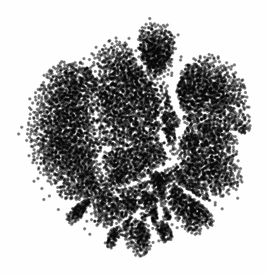

# Dimensionality reduction spectrum for single-cell data

## Introduction
This project comes directly from the work of the Berens Lab at University of Tübingen, Germany. Specifically, it comes from the constractive-ne python package that they wrote, which can be found [here](https://github.com/berenslab/contrastive-ne).

The name of their method is Contrastive Neighborhood Embeddings, which can be found in their ICLR 2023 paper, called From t-SNE to UMAP with Contrastive Learning, [here](https://openreview.net/forum?id=B8a1FcY0vi).

This work is highly relevant to the flow/CyTOF and single-cell sequencing community, especially now, as nonlinear dimensionality reduction algorithms have been under increasing scrutiny.

The authors create a generalization of t-SNE and UMAP, such that they can produce a spectrum of embeddings that range between highly local preservation (like t-SNE) and more global preservation (like UMAP).

Here, I replicate their findings using CyTOF data, so other single-cell users will hopefully be willing and able to do the same. Using a flagship bone marrow dataset, known in the field as the "Samusik dataset" I show that I can indeed create a spectrum of embeddings that range from t-SNE like to UMAP like. Accordingly, viewing the whole spectrum gives me better intuition around the dataset, rather than simply choosing UMAP and stopping there.

## Usage
Install the Berens Lab contrastive-ne package:

```sh
pip install contrastive-ne
```
Go to src/make_gif.ipynb to see exactly how the embeddings are created. As the name states, the code provided will create the gif that you see below (note that it may take a few seconds for it to load).

Generally speaking, the code will make an embedding, save the image, and make the next embedding one notch down the spectrum, and so on. Once you have a folder full of images, you can convert them into a gif.




